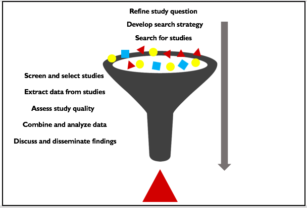

## Systematic reviews defined

Systematic reviews are comprehensive literature reviews conducted using established methods to find, appraise and synthesize existing research to answer a question. Systematic reviews are considered to be a reliable source of evidence to inform decision-making because they gather all of the available research evidence on a topic in an unbiased, transparent and reproducible way. 

Systematic reviews differ from traditional, 'narrative' literature reviews in the following ways:

| Systematic Reviews | Traditional Literature Reviews |
| ------------------ | ------------------------------ |
| The review question is focused, well-defined and specific | The review question is broad or open-ended with vaguely defined concepts |
| Searches for studies are exhaustive, cover many databases and include both peer-reviewed and gray literature sources | Searches in narrative reviews are often non-exhaustive and only include a few sources |
| Searches are reported and well-documented such that they can be reproduced at a later date by other researchers | The method to find studies is often vague if reported at all |
| Studies are selected based on pre-specified, well-defined criteria | Study selection usually involves  a 'cherry-picking' approach including studies already known to the author |
| Included studies are assessed for study quality and potential biases, and weighted accordingly in the analysis | Included studies are usually not assessed for quality or bias |
| Analysis may include meta-analytical quantitative methods | Analysis tends to be more qualitative in nature |

## The steps in a systematic review

A systematic review begins with a well-defined research question. The figure below indicates the step-by-step process used to search for studies, identify studies for inclusion, carry out analyses and report findings. 

## The role of an  information expert 

Given the need for comprehensive, reproducible searches and intensive information management, trained librarians and information professionals are a critical component to performing a high quality systematic review. 

Information specialists and librarians can assist in the following ways:

- Refining the research topic to an answerable research question appropriate for a systematic review.
- Developing search strategies, including identifying sources to search, harvesting search terms, and designing Boolean search across various databases.
- Gathering and deduplicating bibliographic records resulting from comprehensive database searches.

## Automating systematic reviews

Systematic reviews are intensive, time-consuming projects often involving multi-person teams over many months or even 1-2 years or more. Thus, much is underway to identify ways in which parts of the process can be sped up, facilitated or automated. 

The R package litsearchr provides a method to facilitate the harvesting of search terms to develop comprehensive search strategies, and to automatically create Boolean searches from lists of keywords, including incorporation of truncation and phrases.

> ## Think-Pair-Share: Pros and Cons of automation
> Think about the steps of a systematic review. What steps of the review process could benefit from automation? Are there 
> any negative impacts to automating parts of the systematic review process? Share your thoughts with a partner, and then 
> share with the rest of the group.
{: .callout}

